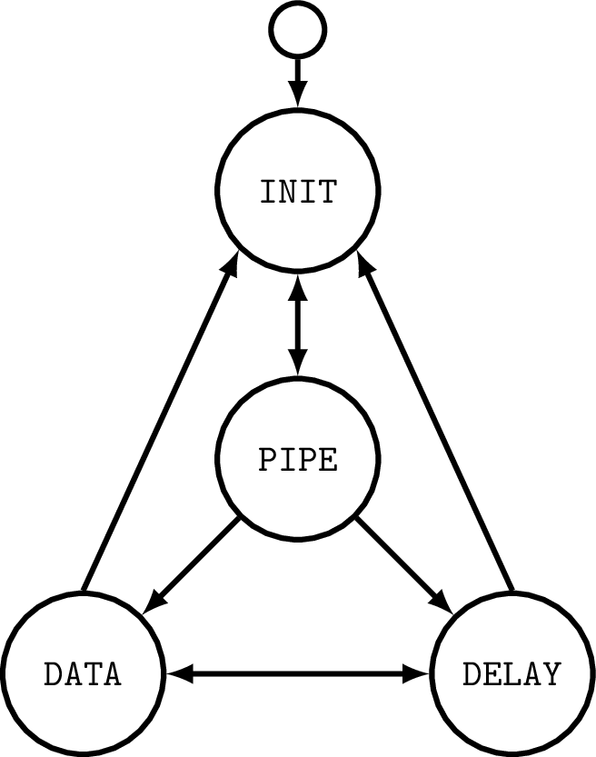

# x_micro_sequencer


## Pin Out

| Signal      | Width       |
| ----------- | ----------- |
| i_clk       | 1           |
| i_rst       | 1           |
| i_start     | 1           |
| o_busy      | 1           |
| i_wen       | 1           |
| i_wcmd      | 4           |
| i_wdata     | 36          |
| i_waddr     | 9           |
| o_data      | 36          |

## RAM

- The RAM is 40 Bits Wide
- The RAM has 512 entries
- This is constructed from 5 Qty 512 x 8 (4 k) FPGA BRAMs

## Start and Stopping

- A rising edge of `i_start` will start the sequencer
- `o_busy` is cleared using the `END` command


## Write Interface

 - `i_wen` triggers a write
 - if `o_busy` is high the write is ignored

```
if (i_wen == 1) and (o_busy == 0) {
   RAM[i_waddr] = {i_wdata, i_wcmd}
}
```


## Commands

| Code       | Name | Detail                          |
| ---------- | ---- | ------------------------------- |
| 4'b0000    | DAT  | Change data output              |
| 4'b0001    | DEL  | Delay a number of cycles        |
| 4'b0010    | END  | End sequence with zero          |
| All Others | RFU  |                                 |

## Counter
  
- Capable of delaying up to 1ms at 100MHz (10^5) 
- The counter is 17-bits wide (131071) 

## State Machine




